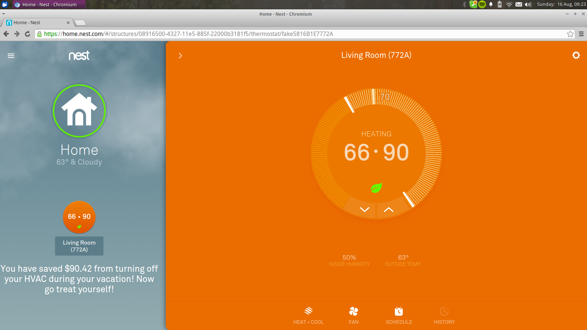

# Nest-Vacation-Tracker
### Hack the Planet

So you just booked a vacation and are super stoked about relaxing for a couple of weeks on your trip.  You are busy packing and planning for your weekend; maybe you're getting your kids and their belongings corralled. The last thing you need is the worry of forgetting something important-- perhaps something that could cost you a lot of money by the time your vacation is over. What if there was a way for your Nest thermostat to automatically know when you are leaving for vacation?

Nest currently has an Auto-Away feature that will keep your room 5-10 degrees within your desired room temperature.  However, this only fulfills the need when you are away for the short-term, eg. a couple of hours/ a day.  Currently, there doesn't exist a way to automatically turn on power saving mode for your Nest thermostat when you leave for the long term, eg. a week/ a month.  Manual intervention is needed...

Till now!



We have created an algorithm that will be able to determine when you are leaving out of town by utilizing the Gmail API and extracting your flight information automatically. Once we determine the dates that you are gone for, we command our Nest thermostat to execute the best money-saving action depending on your region for while you're gone.  We have integrated a weather API that will determine the surrounding temperature and determine if turning off the HVAC system or setting the temperature to a minimum/maximum value is the most optimal solution to save costs.  For instance, in colder areas, we wouldn't want the HVAC system to completely turn off but instead maintain the lowest temperature so that the water pipes don't freeze while you're gone. Also, right before you return home, it automatically turns the thermostat back to normal so you can come back to comfort. We have also integrated a cost saving calculator to the main Nest Home UI that will show how much you have saved!

Finally, for additional peace of mind, we integrated the Twilio API to text you once our algorithm activates so that you can be absolutely sure everything's fine!

## How to start

then...

```sh
sudo npm install
phone='1231231231' npm start
```
